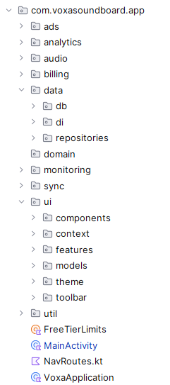
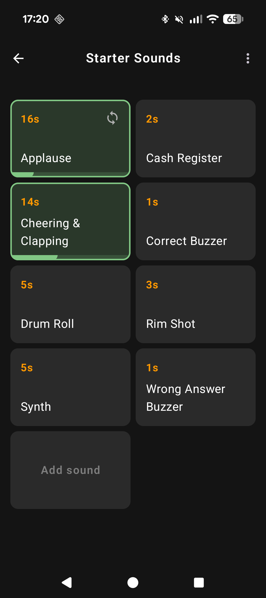
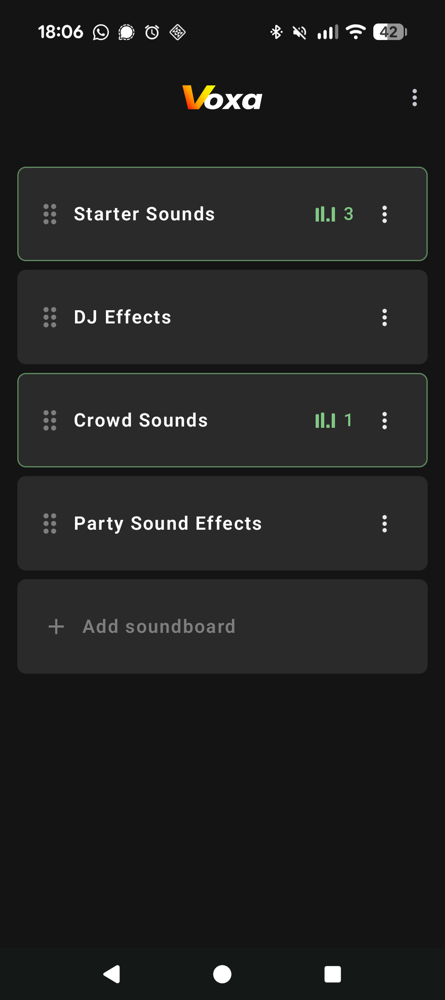
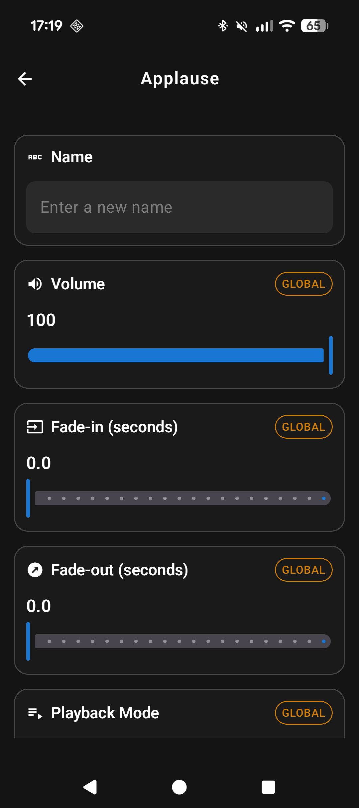
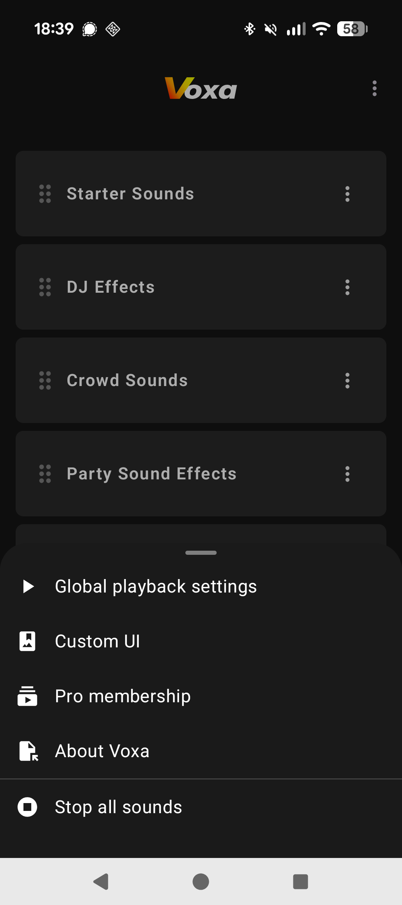

## Overview

Voxa Soundboard Studio is an Android app that allows importing and playing back of audio. It was released on the 6th June 2026.  

This is a small slice of the codebase, not the full project. These are excerpts with dependencies (other composables, Dimens, R.string.*, DI graph) that live in the private repo, so imports will not resolve if the project is built. 

## Files

| File | Location | Purpose |
|------|----------|---------|
| `SoundboardListScreen.kt` | `ui/features/soundboardlist` | UI |
| `SoundboardListViewModel.kt` | `ui/features/soundboardlist` | State/business logic |
| `SoundboardRepositoryImpl.kt` | `data/repositories` | Data layer |
| `SoundboardListPreviewFixtures.kt` | `ui/features/soundboardlist` | Compose preview data (for previews and tests) |
| `SoundboardListViewModelTest.kt` | `test/ui/features/soundboardlist` | ViewModel test |
| `SoundboardListContentsScreenshotTest.kt` | `test/ui/features/soundboardlist` | Compose screenshot test (Paparazzi) |
| `FakeSoundboardRepository.kt` | `test/data/repositories` | Test fake for `SoundboardRepository`, used across the ViewModel tests |
| `SoundboardListContentsTest.kt` | `androidTest/ui/features/soundboardlist` | Instrumented Compose UI test |

## Features

Features of the app as a whole:

- Create unlimited soundboards and sounds
- Import your own audio and record straight from a mic/phone.
- Manipulate sounds - fade in/out, adjust volume, loop/queue/quick restart sounds.
- Batch import, delete, and reorder sounds.
- Audio is saved directly to the app folder (so permissions are not lost, and so that it will continue to play even if it's deleted or moved to another folder).

The feature included here (along with some surrounding classes) is the opening screen that displays the list of soundboards. A couple of notable features of this screen are:

- Snackbar messages in place of Toasts. I chose Snackbars as these are more accessible than Toast messages. They are part of the view/composition hierarchy, whereas Toasts are displayed outside of this and so never get read out loud.
- A scan is performed to detect whether audio shown in the DB is missing from the app file storage. This would indicate that perhaps this is a new device for this user, and that a scan of the user's audio on their device in order to re-import the audio is needed. 

## Testing

Some test files are included. These run automatically on Firebase Test Lab via GitHub actions whenever the version code is increased (i.e. when I'm creating a new build to go to the Play Store). They also run automatically every 8 hours so that errors in code can be picked up quickly.
The testing strategy includes: 

- Standard JVM tests (including Compose screenshot testing via Paparazzi).
- Test fakes in place of certain classes, i.e. repositories. I prefer this over mocking, as it gives more control.
- Turbine for Flow assertions.
- Compose UI testing (instrumented testing). This uses Compose semantics-tree assertions to ensure that the correct items are displayed at any given moment.

## Architecture

- Single-activity app built entirely in Jetpack Compose.
- Type-safe Compose Navigation for routing.
- MVVM.
- Hilt for Dependency Injection.
- Data flows through a repository layer backed by Room (DAOs → repositories → ViewModels).
- Interfaces for testability.
- Audio playback is handled by a dedicated ExoPlayer-backed service layer.  

## Screenshots

  
  
  
  
  

## Links

[Play Store link](https://play.google.com/store/apps/details?id=com.voxasoundboard.app)  
[Full case study](https://scribbleapps.com/case-study.html)
